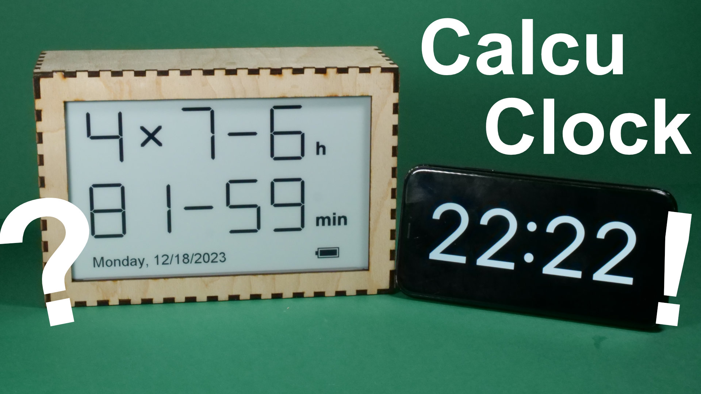
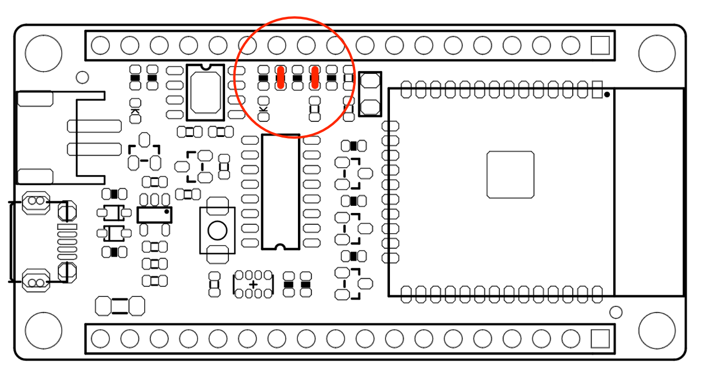
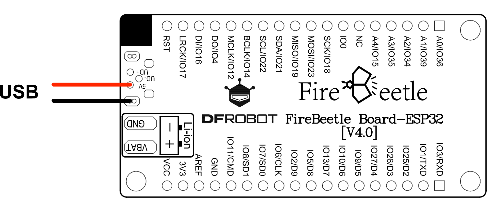
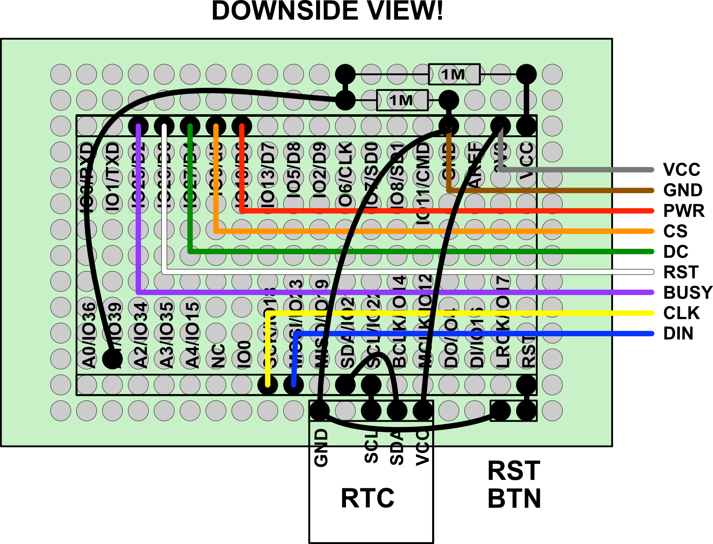

# CalcuClock

Inspired by a commercial product (Albertclock), I always wanted to create a similar project. The idea is, that the time is displayed as two simple math expressions, which the user has to solve in order to read the clock.
Take it as an educational mean or just a geek toy. ;-)

I used a Firebeetle ESP32 microcontroller board, which has a very low deep sleep current, a Wireshare 7.5 inch ePaper display and a DS3231 real time clock module. The clock is powered by a 10,000 mAh recharchable LiPo-battery, which hopefully will provide a very long duration before recharging, so you can place it anywhere you want (desk, shelf, wall) without a cable attached.

You can easily set up time and time zone by using a standard smartphone and WiFi.

You can watch the clock in action and how I made it at https://youtu.be/ywXnWx0vjIA.

## Hardware

### Part List

| Part                                                | Link                                                                                    |
|-----------------------------------------------------|-----------------------------------------------------------------------------------------|
| Firebeetle ESP32 Microcontroller Board              | https://www.dfrobot.com/product-1590.html                                               |
| Waveshare E-Paper Driver HAT                        | https://www.waveshare.com/product/displays/e-paper/driver-boards/e-paper-driver-hat.htm |
| Waveshare 800×480, 7.5inch E-Ink raw display        | https://www.waveshare.com/7.5inch-e-paper.htm                                           |
| Makerfocus 10,000 mAh LiPo Battery                  | https://www.amazon.de/gp/product/B0953L98RK                                             |
| USB-C power socket                                  | https://www.amazon.de/gp/product/B0C6D2YS1V                                             |
| Push Button Switch                                  | https://www.amazon.de/gp/product/B081TZFZVS                                             |
| DS3231 RTC module                                   | https://www.amazon.de/gp/product/B07GZHTKCS                                             |
| 2 x 1 MOhm resistor                                 |                                                                                         |
| 1 x 100 nF capacitor                                |                                                                                         |
| 3 mm plywood                                        |                                                                                         |
| Breadboard, screws, cables, spacer, pin header, etc |                                                                                         | 

### Microcontroller

The microcontroller board comes with a voltage divider for measuring battery voltage, but two connections have to
be bridged in order to make this divider work:

You could use a USB cable extension to make the USB connection accessible from outside the box, but I wanted to use a
USB-C power socket, so I had to connect it to the board directly:

### Bread board

Unfortunately, the Firebeetle does not come with a USB voltage sensor. So I had to install an extra voltage divider on
my own with two 1 MOhm resistors. I used a breadboard and pin headers to connect the microcontroller, the RTC module and
the reset button. I soldered the E-Paper driver cable directly to the board:

### RTC module

I had some troubles with the accuracy of the RTC module. A 100nF capacitor between GND and VCC soldered directly to 
the module helped.

### Casing

For the casing you would need a laser cutter. I used a Snapmaker A350T with 40W laser module and standard settings.
You can find the cutting blueprints as SVG files in the [box](box) directory.

## Software

Just install a micropython firmware on the ESP32 and copy all the files from [code](code) to the microcontroller file system.
I recommend using Thonny (https://thonny.org/) for that. Be patient, this may take a while.

The digits are pre-rendered and the math expressions are pre-calculated. You can easily change either of them using the 
Python scripts provided in the [tools](tools) directory.

## Usage

After assembling the clock (see video for that), you have to set the time, time zone and date format. For that,
the ESP32 opens a Wifi network (SID "calcuclock") and provides a simple web interface on http://192.168.4.1.
The WiFi password is generated randomly at first activation of the clock.

To make setup easy for a user with a smartphone, the clock displays two QR codes on the e-paper display - one for the 
WiFi settings and one for the URL. Just scan and execute the QR codes as displayed on the e-paper and the setup
interface will appear on your phone. Choose your settings and press "Synchronize". The current date and time will be
read automatically from your phone and sent to the clock. After that the clock will switch to regular work mode and
displays the time as math equations. The display will be updated every minute.

If you want to change the settings later on, just press the reset button on the back of the clock and it will go to
setup mode again.

## Limitations

While the time zone selection should be sufficient, I only implemented two date formats: English and German. Please feel
free to add further. Just add them to the dt_formats object in the [code/clock.py](code/clock.py) file.

I also implemented a 24h mode only. If you really want a 12h AM/PM display, you would have to modify the code.
